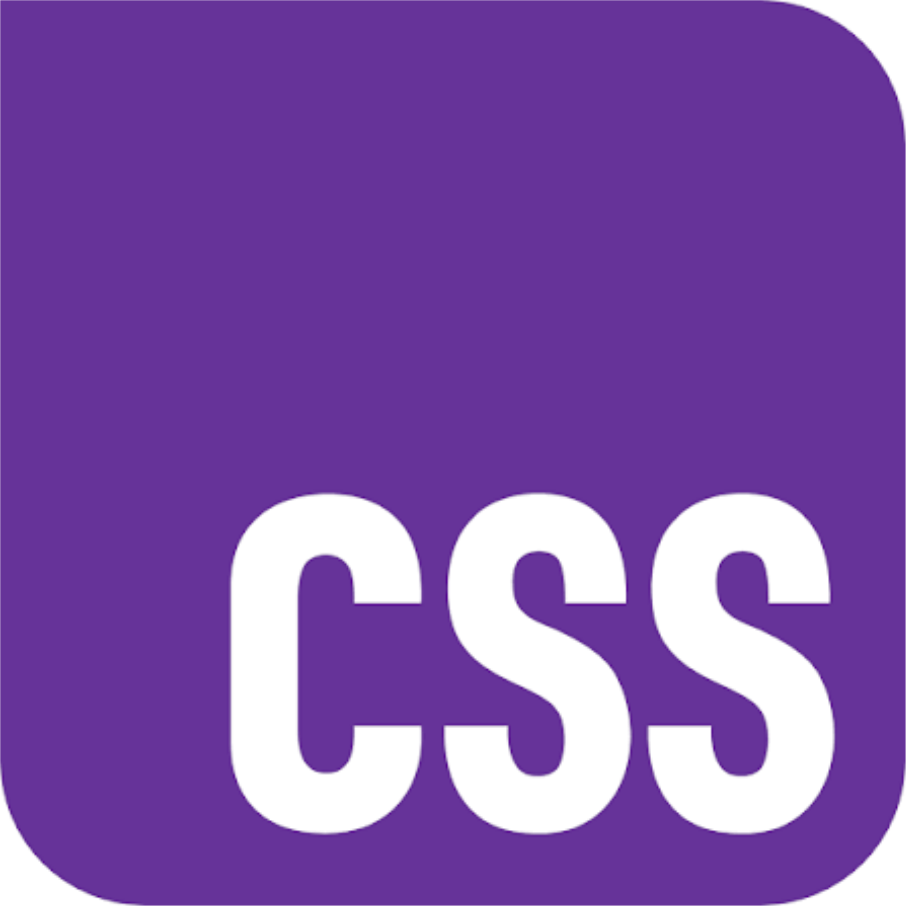
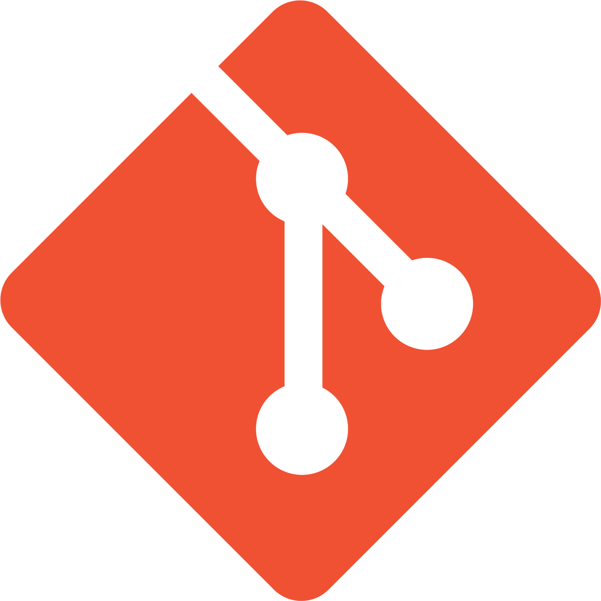
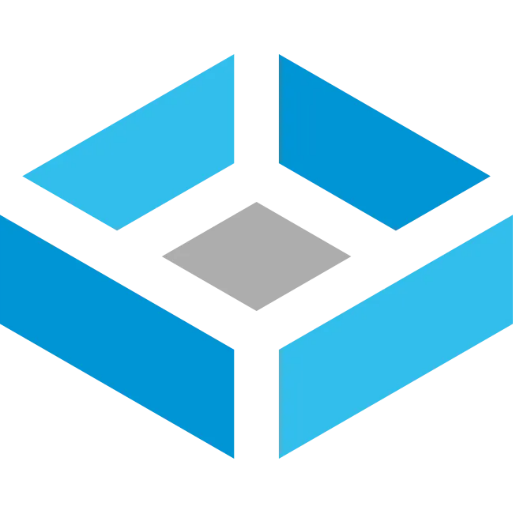
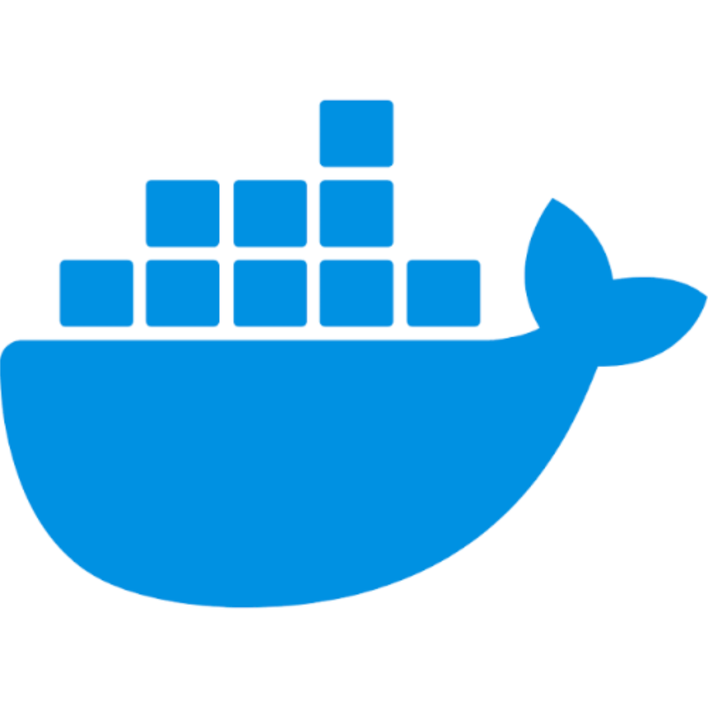
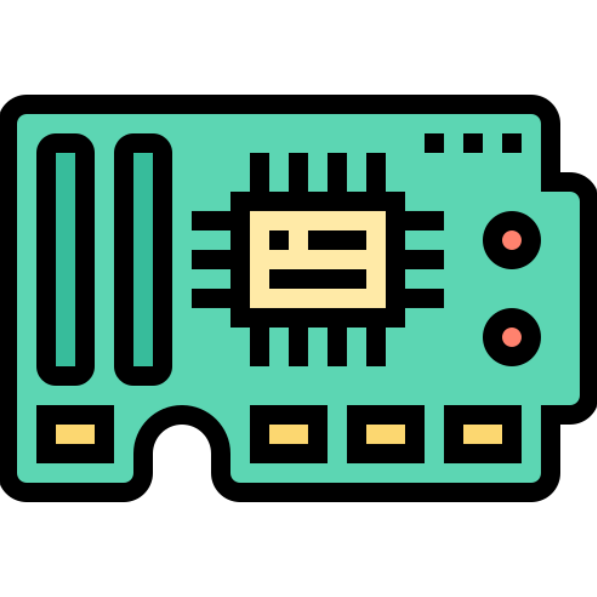
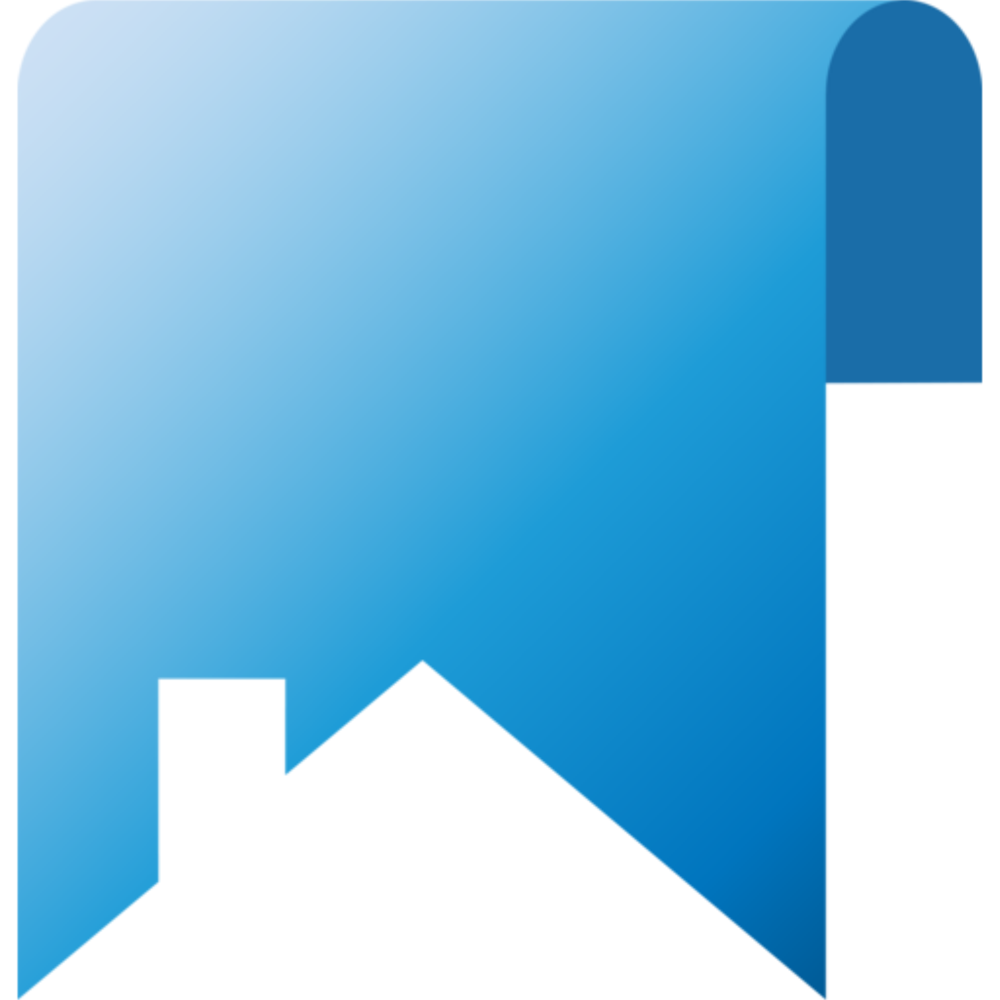
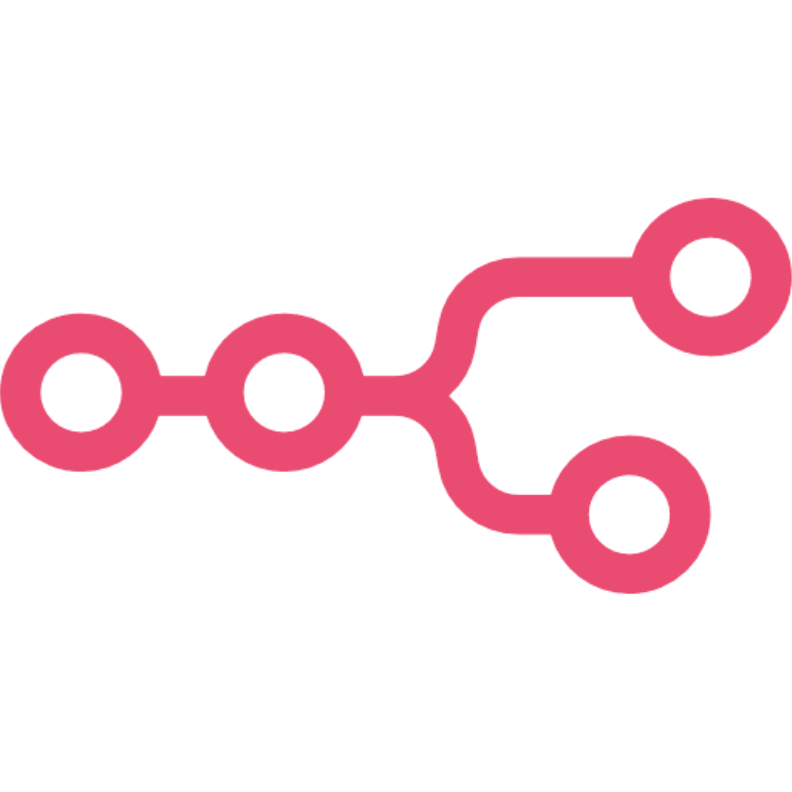
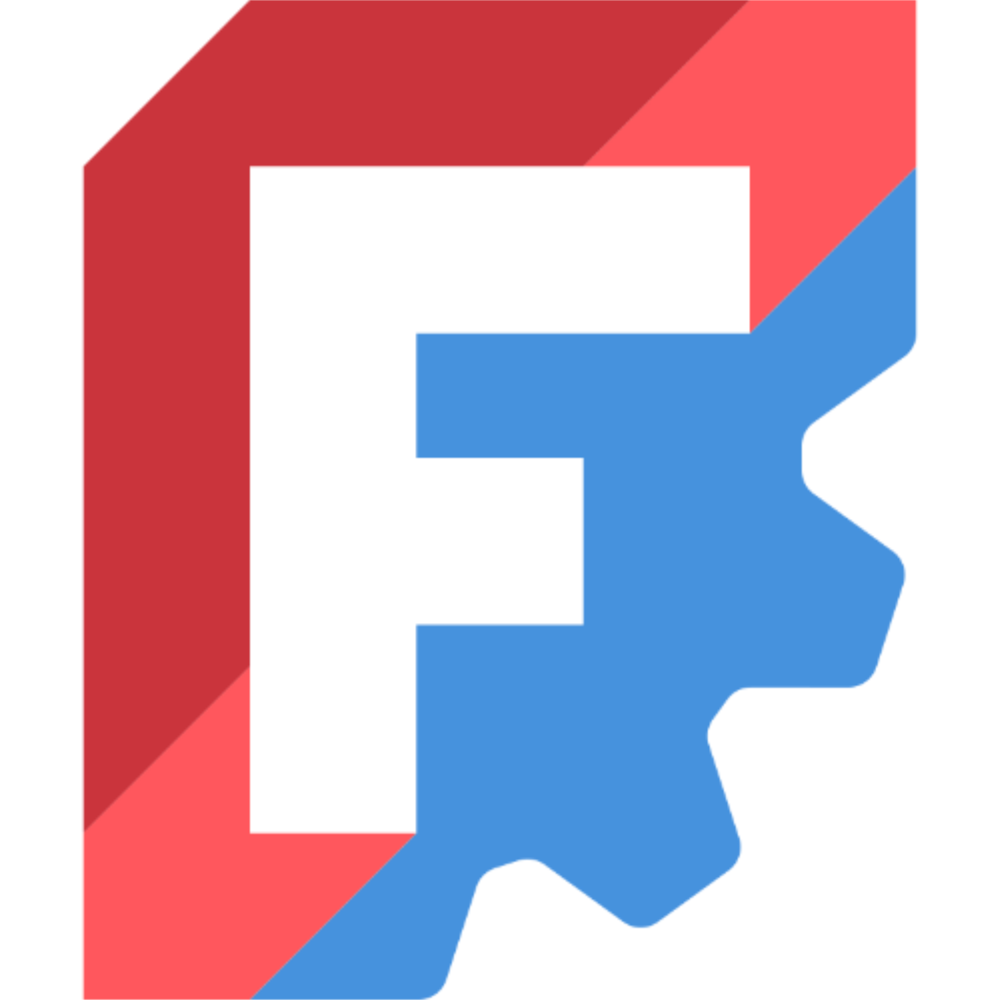
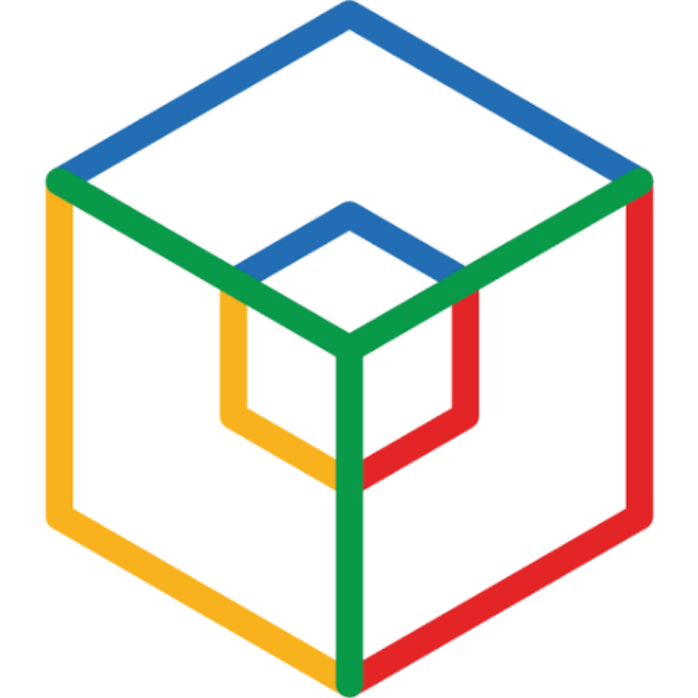
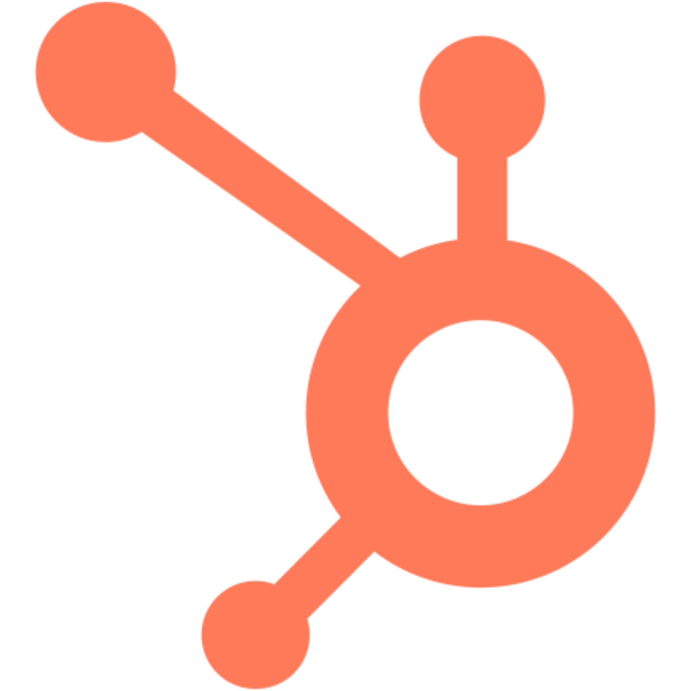

  
  

<table width="100%">
  <!-- Section: Languages (12 columns total: 1 title, 11 icons, 0 padded) -->
  <tr>
    <td valign="middle" align="left"><h3>Languages</h3></td>
    <td align="center" style="line-height: 1;"> Rust</td>
    <td align="center" style="line-height: 1;"> Dart</td>
    <td align="center" style="line-height: 1;"> Python</td>
    <td align="center" style="line-height: 1;"> Nix</td>
    <td align="center" style="line-height: 1;"> NuShell</td>
    <td align="center" style="line-height: 1;"> PowerShell</td>
    <td align="center" style="line-height: 1;"> Bash</td>
    <td align="center" style="line-height: 1;"> SQL</td>
    <td align="center" style="line-height: 1;"> HTML</td>
    <td align="center" style="line-height: 1;"> CSS</td>
    <td align="center" style="line-height: 1;"> Git</td>
  </tr>

  <!-- Section: Platforms (12 columns total: 1 title, 11 icons, 0 padded) -->
  <tr>
    <td valign="middle" align="left"><h3>Platforms</h3></td>
    <td align="center" style="line-height: 1;"> Proxmox</td>
    <td align="center" style="line-height: 1;"> TrueNAS</td>
    <td align="center" style="line-height: 1;"> Debian</td>
    <td align="center" style="line-height: 1;"> Ubuntu</td>
    <td align="center" style="line-height: 1;"> NixOS</td>
    <td align="center" style="line-height: 1;"> Windows</td>
    <td align="center" style="line-height: 1;"> Android</td>
    <td align="center" style="line-height: 1;"> macOS</td>
    <td align="center" style="line-height: 1;"> iOS</td>
    <td align="center" style="line-height: 1;"> Web</td>
    <td align="center" style="line-height: 1;"> Docker</td>
    <td align="center" style="line-height: 1;"> Embedded</td>
  </tr>

  <!-- Section: UI Frameworks (12 columns total: 1 title, 3 used, 8 padded) -->
  <tr>
    <td valign="middle" align="left"><h3>UI Frameworks</h3></td>
    <td align="center" style="line-height: 1;"> Dioxus</td>
    <td align="center" style="line-height: 1;"> Flutter</td>
    <td align="center" style="line-height: 1;"> Flet</td>
    <td colspan="9"></td> <!-- Invisible padding block -->
  </tr>

  <!-- Section: Databases (12 columns total: 1 title, 3 used, 8 padded) -->
  <tr>
    <td valign="middle" align="left"><h3>Databases</h3></td>
    <td align="center" style="line-height: 1;"> Postgres</td>
    <td align="center" style="line-height: 1;"> SQLite</td>
    <td align="center" style="line-height: 1;"> SurrealDB</td>
    <td colspan="9"></td> <!-- Invisible padding block -->
  </tr>
</table>

 

<h3>FOSS</h3>

  
  
  
  
  
  
  
  
  
  
  
  
  
  
  
  
  

<h3>Creative Tools</h3>

  
  
  
  
  
  
  
  

<h3>Online Platforms</h3>

  
  
  
  
  

